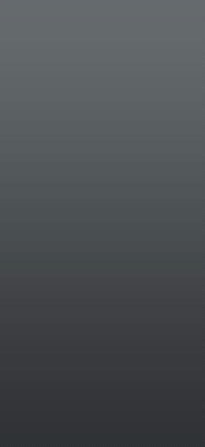
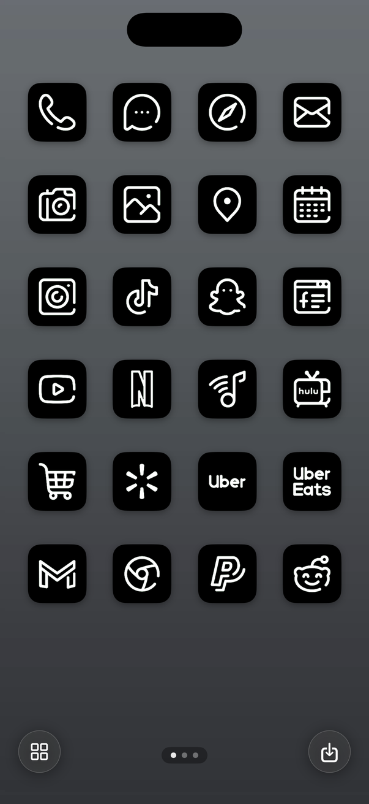

# Motionary

**Animated, full-screen iPhone Home Screen widgets, with tappable app launchers
placed on them.**

A design is a video clip, positioned on the screen, with app tiles on top. The
widget plays it. The wallpaper behind carries the rest of the picture, so the two
read as one continuous scene — the animation appears to fill the whole phone.

<p align="center">
  
  &nbsp;&nbsp;
  
</p>

<p align="center">
  <em>Left: a design playing. Right: the iPhone app, showing the same composition with its tappable tiles.</em>
</p>

iOS has no animation API in a widget worth using for this. Motionary animates by
abusing the one thing the system re-renders on its own: `Text(date, style:
.timer)`. Frames of video are baked into colour font glyphs, and the ticking
timer swaps one picture for the next. [How it
works](docs/HOW-IT-WORKS.md) explains the whole mechanism.

---

## Read this before you start

This is a personal project published for reading and building, not a product.
Some of its constraints are unusually sharp, and they are not bugs:

- **A Mac is required.** Designs are made on macOS. They cannot be made on the
  phone — see [the
  constraint](docs/HOW-IT-WORKS.md#the-constraint-everything-follows-from).
- **A design can be built two ways, and they are not equivalent.** Built as
  fonts, its frames are colour glyphs, it gets a thirty-second loop, and it can
  only reach a phone by being compiled into the widget extension and installed.
  Built as pictures, it is a two-second loop that can be **delivered to a phone
  that already has the app** — `Tools/deliver.sh`, or any file that reaches the
  app through AirDrop or Files. Which one you want depends on whether the
  design has to travel.
- **Only the iPhone 17 Pro is calibrated.** The widget's frame is measured
  against real hardware, not derived. On any other device the composition will
  be visibly misaligned against the wallpaper. Adding a device means measuring
  it — see [Adding a device](docs/USAGE.md#adding-a-device).
- **You need your own Apple developer team** to sign a build for your own phone.
- **There is no App Store build**, and the [licence](LICENSE) does not permit
  publishing one.

If that is acceptable, the whole thing takes about twenty minutes to stand up.

## Requirements

| | |
|---|---|
| macOS | 14 or later |
| Xcode | Any version carrying the iOS 26+ SDK, with a matching simulator |
| [XcodeGen](https://github.com/yonaskolb/XcodeGen) | `brew install xcodegen` |
| iPhone | iPhone 17 Pro, on iOS 26+, for a device install |
| Apple ID | Any account that can sign a development build |

`ffmpeg` and Python 3 are needed only by the analysis scripts in `Tools/`.

## Quickstart

```sh
git clone <your-fork-url> motionary
cd motionary
xcodegen generate        # the .xcodeproj is generated, never committed
```

Set your signing team and a bundle identifier prefix you own in `project.yml`,
then regenerate. Full walkthrough in **[docs/INSTALL.md](docs/INSTALL.md)**.

Build and run the editor:

```sh
xcodebuild -scheme MotionaryStudio -destination 'platform=macOS' build
```

Drop a clip into Motionary Studio, position it, place your tiles, press build.
Studio generates the lane fonts, copies them into `Resources/`, rewrites
`UIAppFonts` in both `Info.plist`s, regenerates the project, builds for your
phone and installs it.

The same pipeline runs headless, which is how it is tested:

```sh
MotionaryStudio --build clip.mp4               # generate only
MotionaryStudio --build clip.mp4 --bundle      # generate and compile in
MotionaryStudio --build clip.mp4 --device UDID # the whole job
```

Every flag is documented in **[docs/USAGE.md](docs/USAGE.md)**.

> **A fresh clone has no designs in it.** `Resources/prebuilt-*` and `MFont*.ttf`
> are build output — around 60MB per design — so they are not committed. The app
> and widget build fine without them and say "No design is built into this app
> yet". Make one with Studio.

## Documentation

| Document | What it covers |
|---|---|
| **[Install](docs/INSTALL.md)** | Prerequisites, signing, first build, putting it on a phone |
| **[Usage](docs/USAGE.md)** | The Studio workflow, every CLI flag, adding a device, troubleshooting |
| **[How it works](docs/HOW-IT-WORKS.md)** | The timer-font mechanism, from the top |
| **[Pitfalls](docs/PITFALLS.md)** | Things that have bitten, and will again |
| **[Contributing](CONTRIBUTING.md)** | Layout, where code goes, how this project measures things |
| [Widget animation surface](docs/widget-animation-surface.md) | Every route to animating a widget, and which ones are dead |
| [Home Screen compositing](docs/home-screen-compositing.md) | The measured geometry, and why it is measured |
| [Studio design brief](docs/studio-design-brief.md) | The editor's design intent |

## How it works, briefly

A widget's view is built inside the extension and rasterised somewhere else. **A
font only draws if it was in the extension's bundle at install time and declared
in `UIAppFonts`.** Runtime registration resolves by name and then draws nothing.
That single fact is why designs are compiled on a Mac.

Given that, the animation works like this:

1. A frame of video is JPEG-encoded, base64'd, and embedded in an OT-SVG colour
   glyph.
2. A `GSUB` ligature maps a run of timer digits to that glyph, so as the timer
   advances the system swaps one picture for the next.
3. One font carries 15 frames — a "lane". 32 to 64 lanes are stacked, and a
   blink-mask font makes one lane visible at a time.
4. The cycle is 30 seconds, anchored to wall-clock time so the app and the widget
   agree on which frame is showing.

Only the moving part of the frame goes into the glyphs; the rest is one still
backdrop. A design animating 24% of the widget costs a quarter of the decoded
bitmap that a full-screen one would.

Read [docs/HOW-IT-WORKS.md](docs/HOW-IT-WORKS.md) for the full account, and
[docs/widget-animation-surface.md](docs/widget-animation-surface.md) for the
routes that were tried and closed.

## Repository layout

```
Mac/        Motionary Studio, split into Studio / Install / Library
Shared/     Both platforms: Model, Rendering, Storage, Pipeline,
            Diagnostics, Icons, SFNT
App/        The iPhone viewer
Widget/     The extension
Tests/      The unit suite, run on the simulator
UITests/    Drives SpringBoard from inside the simulator to photograph the widget
Tools/      Shot loops and analysis scripts
docs/       What was measured, and what it cost to find out
```

## Testing

```sh
xcodebuild -scheme Motionary -destination 'platform=iOS Simulator,name=iPhone 17 Pro' \
  -only-testing:MotionaryTests test
```

The widget can only really be judged by looking at a rendered one. `Tools/`
drives SpringBoard from inside the simulator to do that without needing anyone's
screen — see [Usage](docs/USAGE.md#looking-at-the-result).

## Licence

**Source-available, not open source.** You may read, build, modify and run this
for personal, educational and research use. You may not redistribute it or
publish a build. See [LICENSE](LICENSE).

Third-party components keep their own licences, including the MIT-licensed
shaping template this project's font trick is built on. See
[THIRD_PARTY_NOTICES.md](THIRD_PARTY_NOTICES.md).

## Credits

The timer-font animation technique originates with Bryce Bostwick's
[WidgetAnimation](https://github.com/brycebostwick/WidgetAnimation); the shaping
template and blink-mask font here derive from it. Icons are fetched from
[Iconify](https://iconify.design).
