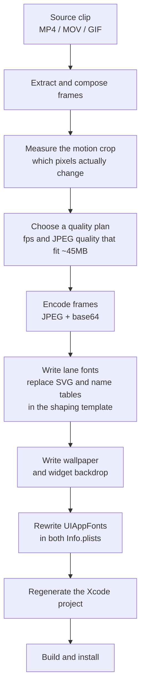

# How Motionary works

iOS gives a widget no way to animate. Motionary animates one anyway, by taking
the only thing the system re-renders on its own schedule — a countdown timer —
and making each tick of it swap a picture.

This document explains the whole mechanism from the top. For the experiments
behind it, including every route that was tried and closed, see
[widget-animation-surface.md](widget-animation-surface.md).

- [The constraint everything follows from](#the-constraint-everything-follows-from)
- [The animation trick](#the-animation-trick)
- [Lanes, and how one frame is chosen](#lanes-and-how-one-frame-is-chosen)
- [Staying in step with wall-clock time](#staying-in-step-with-wall-clock-time)
- [Paying for only what moves](#paying-for-only-what-moves)
- [One picture, two halves](#one-picture-two-halves)
- [The build pipeline](#the-build-pipeline)

## The constraint everything follows from

A widget's view is built inside your extension, but it is **rasterised somewhere
else** — in a system process, from an archived view tree.

That has one consequence which shapes this entire project:

> **A font only draws if it was in the extension's bundle at install time and
> declared in `UIAppFonts`.**

Register a font at runtime and it resolves *by name* inside the extension —
`CTFontCreateWithName` hands back something that claims to be your font — and
then draws nothing where the glyph is actually rendered. Sometimes WidgetKit
rejects the whole timeline instead. Either way the widget is black, and a black
widget is indistinguishable from a broken one.

Every escape route was tested and closed: `.process` and `.persistent`
registration, `CTFontManagerRegisterGraphicsFont`, `Font(CTFont)`, App Group URLs
in the archive, and the private `_wantsCustomFontsEmbeddedInArchive` flag — which
is real, and linkable, and embeds nothing.

So, for the font engine:

- designs are compiled on a Mac and shipped inside the app, not made on the phone;
- the phone app is a viewer, with no import, no settings and no generation;
- adding or changing a design means a build and an install.

That is not a design preference. It is the only arrangement that draws **frames
made of glyphs**.

> **There is a way around it, measured on 2026-08-12.** The constraint is about
> fonts, and only about fonts. A live timer mask gates an `Image(uiImage:)`
> decoded from bytes written into the app group *after* install — verified on
> device and in the simulator, up to 64 distinct frames at full widget
> resolution, with the extension's footprint never above 12 MB. Frames delivered
> as pictures need nothing in the bundle, so a design can be sent to an
> installed app. The loop is as long as the blink mask's own period: the shipped
> mask substitutes on the timer's seconds and is solid on even ones, so it
> repeats every two - and masks solid one second in five and ten ship beside it,
> so a clip plays as long as it is up to ten seconds. See
> [the measurement](widget-animation-surface.md#411-measured-cost-of-a-runtime-frame-stack--device-2026-08-12).

## The animation trick

`Text(date, style: .timer)` is a live countdown. The system re-renders it on its
own schedule, without the extension running any code. It is the only moving thing
available.

Motionary turns that motion into arbitrary pictures:

1. **A video frame becomes a glyph.** The frame is JPEG-encoded, base64'd, and
   embedded as an `<image>` inside an OpenType SVG colour glyph — the same
   mechanism that draws colour emoji.
2. **A ligature maps digits to that glyph.** The font's `GSUB` table maps a run
   of timer digits onto the glyph. As the timer's digits advance, shaping selects
   a different glyph.
3. **So the timer paints a film strip.** The system thinks it is re-rendering a
   clock. What it draws is the next frame of a video.

The glyph canvas is a 500-unit square standing in for the whole screen. A frame
is placed at the fraction of that square its crop occupies of the screen, with
`preserveAspectRatio="none"`, and the group is shifted up one canvas because
SVG's y axis points down where the font's design grid points up.

## Lanes, and how one frame is chosen

One font can only carry so many frames. The shaping template exposes **15
animation glyphs**, so one font is 15 frames — a **lane**.

To get a real frame rate, lanes are stacked:

```
lane 0   frame 0   frame 64  frame 128  …   15 glyphs
lane 1   frame 1   frame 65  frame 129  …   15 glyphs
lane 2   frame 2   frame 66  frame 130  …   15 glyphs
…
lane 63  frame 63  frame 127 frame 191  …   15 glyphs
```

A design uses 32, 48 or 64 lanes, giving 16, 24 or 32fps. Consecutive lanes hold
consecutive frames, so the stack read in order is the film.

All the lanes are drawn on top of each other at once. A **blink-mask font**
(`Custom-Regular.otf`) then makes one visible at a time: each lane's text is
masked by another timer whose phase is offset by that lane's share of a second,
so exactly one mask is opaque at any instant.

The mask can only isolate one lane within a half of the stack, so the stack is
split in two and the second half is gated as a group.

> **A subtlety worth knowing:** the mask leaks a little. It is not a perfect
> single-lane isolation. It survives because the glyphs are opaque JPEGs — a
> leaked lane is painted over by whichever one is on top, so only one is ever
> seen. A transparent glyph would show every leaked lane at once.

## Staying in step with wall-clock time

The timer is anchored to a whole 30-second cycle:

```swift
let aligned = (secondsSince1970 / 30).rounded(.down) * 30
return Date(timeIntervalSince1970: aligned - 60)
```

Two things fall out of that:

- **The visible frame is a pure function of wall-clock time.** The app can work
  out what the widget is showing without being told, which is how the in-app
  preview resumes exactly where the widget is.
- **The anchor can advance a whole cycle without the picture moving.**

The 60-second lead keeps the elapsed value inside a stable `M:SS` format. A
far-past anchor would widen the string and shift which glyph lands in the visible
slot.

The cycle is 30 seconds because the ligature table keys on the timer's seconds
field, mapping `s` and `s + 30` to the same glyph. A visual loop only reads as
seamless if it divides `lanes × 15` evenly; otherwise the wrap adds a second,
arbitrary cut.

## Paying for only what moves

The payload is the whole problem. Each unique frame is embedded **once per glyph
selection**, so the cost is `lanes × 15` copies of an encoded frame — not one
copy per frame. That multiplier is why a modest crop change moves tens of
megabytes.

Two things keep it survivable:

- **Only the moving region is encoded.** The pipeline measures which pixels
  actually change across the loop and encodes only that rectangle. Everything
  else is one still backdrop. A design animating 24% of the widget costs a
  quarter of the decoded bitmap a full-screen one would.
- **The quality plan is fitted to a measured ceiling.** The extension's memory
  limit is about 45MB. The planner tries the smoothest setting first and steps
  down until the estimate fits, preferring a crisp 16fps loop over a mushy 32fps
  one.

Those numbers were measured, not guessed: a build peaking at 43.3MB drew
correctly, and one at 46.7MB had its render dropped.

## One picture, two halves

The widget is not the whole screen. The illusion of a full-screen animation comes
from cutting one composition into two pieces:

- **Inside the widget frame** → animated, via the lane fonts.
- **Outside it** → a still wallpaper you set in Settings.

For that to read as one scene the two have to line up to the pixel, which is why
the device geometry is measured rather than derived, and why the widget's
backdrop is colour-matched and edge-corrected against the wallpaper it continues.

The system also hands the extension a slightly *larger* frame than the one a
design is cut to, starting 2px further left. Content is laid out from the
rendered origin, and the backdrop is padded to cover the difference. See
[home-screen-compositing.md](home-screen-compositing.md).

App tiles are drawn live by SwiftUI on top of the animation, not baked into the
frames — so they stay sharp, stay tappable, and can change without a rebuild.

## The build pipeline



The font writing is deliberately narrow: Motionary never authors a font from
scratch. It takes the shaping template, which supplies the `GSUB` ligatures,
`cmap` and glyph outlines, and **replaces only its `SVG ` and `name` tables**.
The name table is rewritten because all the lanes register into one process, and
a duplicated PostScript name silently resolves to whichever lane was registered
first.

`Shared/Pipeline/` builds it. `Shared/Rendering/CompositionView.swift` draws it.
`Shared/SFNT/` writes the font container — bytes, not policy.

## Where to read next

| | |
|---|---|
| [widget-animation-surface.md](widget-animation-surface.md) | Every animation route that was tried, and why the others are dead |
| [home-screen-compositing.md](home-screen-compositing.md) | The measured geometry, and what it cost to measure |
| [PITFALLS.md](PITFALLS.md) | Things that have bitten, and will again |
| [USAGE.md](USAGE.md) | Driving the pipeline, and reading it when it goes wrong |
